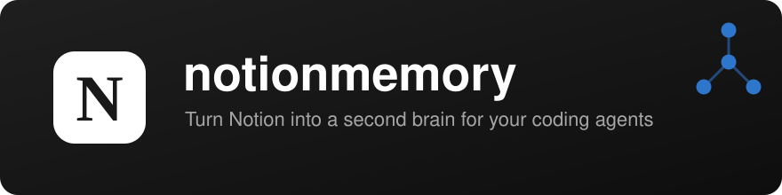
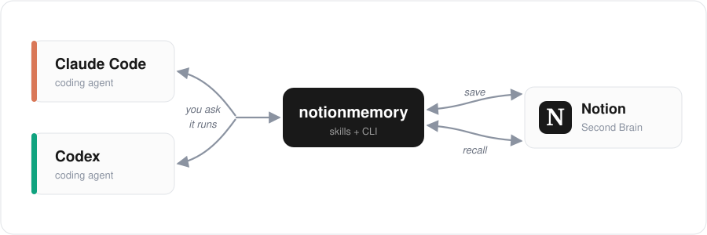
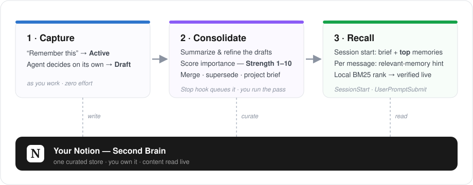

<p align="center">
  
</p>

<p align="center">
  <a href="https://pypi.org/project/notionmemory/"></a>
  
  <a href="../LICENSE"></a>
  
</p>

<p align="center"><a href="../README.md">English</a> | <b>한국어</b></p>

<p align="center">
  <a href="#why-notionmemory">Why</a> ·
  <a href="#install">Install</a> ·
  <a href="#quick-start">Quick start</a> ·
  <a href="#benchmarks">Benchmarks</a> ·
  <a href="#agents">Agents</a> ·
  <a href="#how-it-works">How it works</a> ·
  <a href="#uninstall">Uninstall</a>
</p>

**notionmemory**는 여러분의 Notion을 코딩 에이전트(Claude Code, Codex)를 위한 장기 기억으로
바꿔줍니다. 장기 기억, 캘린더, 템플릿, 내용 검색을 **설치형 스킬**로 제공하고, 세션 훅이 필요한
맥락을 알아서 띄워줍니다. 모든 데이터는 **여러분의 Notion**에 그대로 쌓입니다 — 별도의 DB도,
서버도 없습니다.

명령어를 직접 입력할 필요는 없습니다. 에이전트에게 **평소처럼 말만 하세요** — "이거 기억해둬",
"이거 어디에 정리했더라?", "캘린더에 넣어줘", "이 페이지 템플릿으로 등록해줘" — 그러면 에이전트가
notionmemory를 알아서 실행합니다.

<p align="center">
  
</p>

## Why notionmemory

제가 직접 쓰려고 만들었습니다. [**agentmemory**](https://github.com/rohitg00/agentmemory)나
[claude-mem](https://github.com/thedotmack/claude-mem) 같은 도구는 메모리를 **로컬 벡터
DB**에 저장합니다. 빠르고 프라이빗하지만, 저에게는 두 가지가 계속 아쉬웠습니다.

- **무엇이 저장됐는지 볼 수가 없습니다.** 벡터 DB는 사실상 블랙박스라, 열어서 에이전트가
  "기억한" 내용을 확인하거나 틀린 항목을 고치기 어렵습니다. Notion이라면 그냥 페이지이니, 저장된
  메모리를 제가 직접 읽고 고칠 수 있습니다.
- **기기를 옮기면 기억이 끊깁니다.** 저는 서버와 노트북을 오가며 개발하는데, 한 기기에 저장된
  메모리는 다른 기기와 공유되지 않습니다. Notion은 이미 **클라우드**라, 어디서 작업하든 같은
  기억을 씁니다.

여기에 더해, 에이전트가 코드뿐 아니라 제 **공부 노트와 일정**까지 다뤄주면 좋겠다고 생각했습니다.
그 자료들은 이미 Notion에 있으니까요. 메모리까지 같은 곳에 두면, 숨겨진 별도 DB가 아니라 저와
에이전트가 어디서든 닿는 하나의 공간이 됩니다. 그래서 notionmemory는 **Notion을 클라우드처럼**
씁니다 — 눈에 보이고, 직접 고칠 수 있고, 공유되고, 이미 제 일상이 담긴 곳으로요.

## Install

### 1. 백엔드 설치 (사용자 범위)

**사용자 범위(user scope)**로 설치하세요. `sudo`나 시스템 전역 설치는 피해야 합니다.
notionmemory는 스킬, 세션 훅, 로컬 상태를 홈 디렉터리 아래(`~/.claude`, `~/.codex`,
`~/.config/notionmemory`, `~/.local/state/notionmemory`)에 두기 때문에, 반드시 본인 계정으로
실행돼야 합니다.

```bash
pipx install notionmemory        # 권장 — 격리 설치 + PATH 등록 + 사용자 범위
# 또는: uv tool install notionmemory
# 또는: pip install --user notionmemory
```

### 2. 에이전트에 연결

**여러 에이전트에 설치해도 됩니다** — 오히려 그게 핵심입니다. Claude Code와 Codex가 같은 기억을
공유하니까요. 다만 **에이전트 하나당 설치 방법은 하나만** 쓰세요(플러그인 *또는*
`notionmemory install`). 같은 에이전트에 두 방법을 다 쓰면 스킬이 중복 설치됩니다.

**Claude Code (플러그인)**

```bash
/plugin marketplace add legojeon/notionmemory
/plugin install notionmemory@notionmemory
```

> ⚠️ 플러그인이 스킬과 세션 훅을 함께 설치합니다. `notionmemory install --claude`를 **따로
> 실행하지 마세요** — 중복 설치됩니다.

**Codex (플러그인 + 훅)**

```bash
codex plugin marketplace add legojeon/notionmemory
codex plugin add notionmemory@notionmemory
notionmemory install --codex --skip-skills --trust-codex-hooks
```

> ⚠️ `--trust-codex-hooks`는 필수입니다. 없으면 훅이 아무 표시 없이 동작하지 않습니다.

**플러그인 없이 (한 번에 두 에이전트)**

```bash
pipx install notionmemory && notionmemory install
```

> Codex를 쓴다면 `notionmemory install --codex --trust-codex-hooks`도 실행해야 훅이
> 동작합니다.

### 3. 온보딩 실행

설치가 끝나면 **에이전트에게 "온보딩해줘"라고 말해 보세요.** `notionmemory:onboard` 스킬이
실행되고, 첫 세션에서는 에이전트가 먼저 제안합니다. Notion 연결(페이지를 integration에 공유하는
것까지)부터
memory, calendar, 검색 설정까지 선택지로 안내하고, 이미 끝난 단계는 건너뜁니다. 직접 하실 일은
Notion 토큰을 붙여넣는 것 하나뿐입니다(비밀 값은 채팅으로 주고받으면 안 되니까요). 토큰은
[app.notion.com/developers/tokens](https://app.notion.com/developers/tokens)에서 만들며,
이때 아래를 확인하세요.

- **워크스페이스 (가장 중요):** notionmemory가 사용할 페이지가 들어 있는 워크스페이스를
  고르세요. 토큰은 그 워크스페이스 하나에만 접근합니다.
- **기능(Capability):** **Notion API**는 체크된 상태로 두세요(콘텐츠 읽기/쓰기). "Workers"는
  필요 없습니다.
- **만료일:** **가장 긴 기간**을 고르세요. 만료되면 토큰이 멈추고, 새로 만들어 다시 연결해야
  합니다.

## Quick start

핵심은 저절로 돌아갑니다: **코딩하고 작업하는 동안 에이전트가 Notion 메모리를 자동으로
참고해 컨텍스트를 유지합니다.** 세션이 시작되면 프로젝트 요약과 가장 중요한 메모리가 이미
로드돼 있고, 메시지마다 관련 메모리가 있으면 힌트로 떠오르며, 남길 가치가 있는 결정은
작업 중에 알아서 저장됩니다 — 새 세션이든 다른 에이전트든 지난번 하던 곳에서 바로
이어갑니다.

그 위에서는 그냥 말하면 됩니다 — 에이전트가 알맞은 스킬을 알아서 실행하고, notionmemory
명령을 칠 일은 없습니다. 예를 들어:

**기억하고 불러오기**
> *"인증을 JWT refresh-token 회전 방식으로 바꿨다고 기억해둬."*
> *"레이트 리밋은 어떻게 처리하기로 했었지?"*
> *"이 프로젝트에 대해 지금까지 뭘 알고 있어?"*

**캘린더**
> *"내일 오후 3시부터 4시까지 디자인 리뷰 잡아줘."*
> *"이번 주 일정 뭐 있어?"*

**Notion 검색**
> *"배포 런북 어디에 적어놨더라?"*
> *"Postgres 마이그레이션 노트 찾아줘."*

**템플릿**
> *"이 Notion 페이지를 주간 보고서 템플릿으로 등록해줘."* (URL 붙여넣기)
> *"이번 주에 한 일로 보고서 초안 써줘."*

CLI는 볼 일이 없습니다 — 그리고 메모리는 이렇게 부르는 순간 사이사이에도 계속 일하고
있습니다.

## Benchmarks

검색 품질을 [agentmemory의 공개 평가 하네스](https://github.com/rohitg00/agentmemory/tree/main/eval)
(사람이 라벨한 P@K/R@K, LLM 심판 없음)로 **실제 Notion 샌드박스 DB에 대해** 측정했습니다 —
진짜 `remember` 주입, 진짜 `recall` 질의. [`bench/`](../bench/README.md)로 재현할 수 있습니다.

| 코퍼스 | 어댑터 | R@5 | R@10 | P@5 | MRR |
| --- | --- | --- | --- | --- | --- |
| coding-agent-life-v1 — 개발 세션 15개, 질의 15개 | grep (전문 검색 베이스라인) | 0.967 | 0.967 | 0.227 | 0.824 |
| | **notionmemory** | **1.000** | **1.000** | **0.240** | **0.889** |
| LongMemEval-S (ICLR 2025) 층화 표본 — 6문항, 원시 ~9KB 챗 세션 | grep (전문 검색 베이스라인) | 1.000 | 1.000 | 0.333 | 0.917 |
| | **notionmemory** | **1.000** | **1.000** | **0.333** | **0.833** |

P@5가 낮아 보이는 건 구조적입니다: 문항당 정답 문서가 1~2개라 상한 자체가 0.2~0.4입니다 —
1.0이 아니라 그 상한 대비로 읽어야 합니다.

이 숫자 뒤에 임베딩도 벡터 DB도 없습니다: 작은 로컬 색인(제목·concepts·본문) 위의 어휘
**BM25** 랭킹을 Notion에 라이브 검증하고, 그 위에서 에이전트가 의미 판단을 합니다. 정직한
캐비앗: 두 코퍼스 모두 소규모(수작업 채점 15+6문항 — LongMemEval은 타입별 1문항 표본이지
전체 500문항이 아님)이고, recall 1회 지연은 라이브 Notion 왕복(~1초)이며, 원시 트랜스크립트
코퍼스는 off-label 스트레스 테스트입니다 — notionmemory의 설계된 식단은 증류된 메모리이고,
그쪽 점수는 최소한 같거나 더 좋습니다.

(라이브 표는 LongMemEval 표본입니다 — 전체 500문항은 아래에서 오프라인으로 커버합니다.)

**전체 500문항** LongMemEval-S(오프라인, 출하된 색인 코드 그대로 — `recall`의 순서를
결정하는 컴포넌트, [agentmemory의 실행](https://github.com/rohitg00/agentmemory/blob/main/benchmark/LONGMEMEVAL.md)과
동일한 문항별-색인 `recall_any@K` 프로토콜, `bench/lme_full500.py`로 재현)을 다른
시스템들이 보고한 결과와 나란히 놓으면:

| | **notionmemory**<br>(BM25, 임베딩 없음) | agentmemory<br>(BM25 + 벡터) | agentmemory<br>(BM25만) | MemPalace<br>(벡터 전용) | oracleagentmemory | Letta / MemGPT | Mem0 |
| --- | --- | --- | --- | --- | --- | --- | --- |
| **벤치마크** | LongMemEval-S | LongMemEval-S | LongMemEval-S | LongMemEval-S | LongMemEval | *LoCoMo(다름)* | *LoCoMo(다름)* |
| **표본** | 전체 500문항 | 전체 500문항 | 전체 500문항 | 전체 실행 | 전체 실행 | — | — |
| **R@5** | **0.946** | 0.952 | 0.862 | ~0.966 | 0.944 | 0.832 | 0.685 |
| **R@10** | **0.976** | 0.986 | 0.946 | ~0.976 | — | — | — |
| **MRR** | **0.893** | 0.882 | 0.715 | — | — | — | — |
| **측정 주체** | 우리, 오프라인 색인 실행 | agentmemory | agentmemory | 벤더(자가 보고) | 벤더(자가 보고) | 벤더(자가 보고) | 벤더(자가 보고) |

임베딩 0으로 agentmemory의 BM25-only보다 8pp 위, BM25+벡터 하이브리드와는 0.6pp
차이(MRR은 더 높음)입니다 — 임베딩이 사주는 격차의 대부분이 필드 가중 BM25와 읽기
시점의 에이전트 의미 판단으로 메워집니다. 정직한 캐비앗: 우리 행은 출하된 랭킹 코드의
오프라인 실행이지 라이브 엔드투엔드 경로가 아니고(그건 위 6문항 표), agentmemory 외
행은 각 벤더가 자기 하네스에서 낸 주장이며, LoCoMo 행은 아예 같은 벤치마크도 아닙니다.
리더보드가 아니라 방향 감각용입니다.

## Agents

notionmemory는 **에이전트가 주도**합니다. CLI는 에이전트가 호출하는 수단일 뿐이고, 여러분은
자연어로 말하면 에이전트가 알맞은 스킬을 골라 실행합니다.

| 에이전트 | 설치 방법 | 사용법 |
| --- | --- | --- |
| **Claude Code** | 플러그인(또는 `notionmemory install`) | *"이 결정 기억해둬", "예전에 X 얘기한 적 있나?", "이거 캘린더에 넣어줘"*처럼 말하기 |
| **Codex** | 플러그인 + `install --codex --trust-codex-hooks` | 동일 — 말만 하면 에이전트가 notionmemory를 대신 실행 |

에이전트가 쓸 수 있는 **스킬**:

- **onboard** — 처음 설정 안내 (Notion + memory + calendar + 검색)
- **memory** — Notion 세컨드 브레인에 장기적인 결정·패턴을 저장하고 불러오기
- **calendar** — Notion 캘린더 DB의 일정 조회·생성·이동
- **templates** — Notion 페이지·DB 등록 및 내용 작성
- **library** — Notion 전체 내용 검색
- **settings** — 연결·설정을 위한 로컬 웹 대시보드
- **git** — (선택) 커밋을 memory에 자동으로 기록

## How it works

에이전트는 notionmemory **CLI**를 통해 Notion과 대화하고, CLI는 **Notion REST API**를
호출합니다. 별도의 DB도, 상시 실행되는 서버도 없습니다. 이게 단순한 저장소가 아니라 *메모리*인
이유는 흐름에 있습니다 — 가볍게 저장하고, **중요도를 매겨 정리(consolidate)**한 뒤, 알맞은
순간에 *중요한* 것을 불러옵니다.

<p align="center">
  
</p>

### 무엇이, 어떻게 저장되나

- **메모리**는 Notion "세컨드 브레인" 데이터베이스입니다. 직접 *"기억해둬"*라고 하면 바로
  **Active**로 저장되고, 에이전트가 스스로 판단해 저장하면 **Draft(초안)**로 들어갑니다. 초안도
  불러올 수는 있지만 아직 정식으로 승격되지 않은 상태입니다.
- 모든 메모리에는 **Strength(1–10)** 중요도 점수가 붙습니다. 이 점수로 회수 순위를 정하고, 세션
  시작 때 무엇을 보여줄지 결정합니다.
- 이후 **정리 패스**(`notionmemory memory consolidate`, 본인 터미널에서 실행)가 에이전트를 통해
  초안을 검토합니다. 요약·정제하고, 실제 Strength를 매기고, 가치 없는 건 버리고(→ *Forgotten*),
  중복은 병합하고(→ *Superseded*), 프로젝트별 **요약(brief)**을 갱신합니다. 그래서 DB가 아무거나
  쌓인 더미가 아니라 잘 정리된 상태로 유지됩니다.

### 언제 읽나

- **세션 시작 때** 이 프로젝트의 요약과 **Strength가 높은** 메모리가 자동으로 주입됩니다. 최신순
  나열이 아니라 중요도 기준입니다.
- **메시지마다** 네트워크를 쓰지 않는 로컬 색인이 *"관련 메모리"* 한 줄 힌트를 덧붙일 수 있습니다.
  에이전트는 실제로 관련 있을 때만 `recall`로 자세히 읽고, 아니면 무시합니다.
- **필요할 때** `library search`가 제목·헤딩으로 Notion 전체에서 후보를 찾고, 에이전트가 상위
  후보를 **실시간으로 읽습니다.** 내용은 캐싱하지 않고 항상 최신으로 읽습니다.

### 임베딩 없이 검색하는 법

여전히 벡터 DB도, 임베딩 모델도 없습니다. 메모리 검색은 **BM25** — 희귀한 단어에 더 큰
가중치를 주고 긴 항목이 유리해지지 않게 하는 고전적 어휘 랭킹 — 로 돕니다. 대상은 제목·
concepts·본문을 다루는 작은 로컬 색인인데, 색인에는 미리 계산한 단어 통계와 메모리당
발췌 200자만 담깁니다 — **본문이 디스크에 복제되지 않아** 파일이 작게 유지되고,
메시지마다 도는 조회도 밀리초 단위입니다. 그 위에:

- `recall`은 **로컬에서 랭킹한 뒤 상위 후보만 Notion에 라이브 검증**합니다(배치 쿼리 1회) —
  색인의 속도와 라이브의 진실을 함께 얻고, 사라진 페이지는 색인에서 저절로 정리됩니다.
- `remember`는 색인에 **즉시 반영(write-through)** 됩니다 — 방금 저장한 메모리가 reindex를
  기다리지 않고 바로 검색됩니다.
- Notion 페이지 내용 검색(`library`)은 제목·헤딩 위의 더 단순한 단어 경계 매칭을 유지합니다 —
  그 색인엔 본문을 절대 담지 않습니다.

어느 쪽이든 랭킹의 역할은 *후보*를 내는 것까지입니다. **의미 판단은 에이전트가 직접 합니다.**
상위 후보를 실시간으로 읽고 무엇이 진짜 관련 있는지 가려냅니다 — 벡터 유사도 점수가 근사하려는
그 판단을 LLM은 그냥 해냅니다. 임베딩을 만들고 동기화하고 낡지 않게 관리할 것이 없습니다.

### 메모리는 어떻게 갱신되나

- 새 정보가 이전 것을 **대체(supersede)**합니다(`--supersedes`). 원본은 삭제되지 않고
  *Superseded*로 남습니다. `forget`은 상태를 *Forgotten*으로 바꿀 뿐, 완전히 지우지 않습니다.
- 정리 패스가 시간이 지나며 다시 점수를 매기고 병합해서, 중요도와 프로젝트 요약이 최신으로
  유지됩니다.
- Notion에서 삭제한 페이지는 읽는 순간 로컬 검색 색인에서 **저절로 정리됩니다**(404를 만나면
  그 자리에서 낡은 포인터를 제거). 나머지는 가끔 전체 정리로 쓸어냅니다.

### 왜 MCP 서버가 아니라 CLI + API인가

- 세션 훅(SessionStart / Stop / UserPromptSubmit)은 **평범한 셸 명령**으로 돌아갑니다. 세션
  안에서 상시 열어 두는 MCP 연결이 아니라 CLI가 필요합니다.
- 같은 CLI가 **헤드리스 환경이나 cron**에서도 돌아갑니다(예: 정리 패스). MCP를 지원하는 채팅
  안에서만 쓰는 게 아닙니다.
- 스킬 묶음 + CLI 하나로 **Claude Code와 Codex에서 똑같이** 동작합니다. MCP는 에이전트마다 지원
  범위와 동작이 다릅니다.
- **구성 요소가 적습니다.** 상시 서버가 없고, 토큰은 OS 키링에 있고, 로컬에 남는 건 가벼운 검색
  색인뿐입니다.

**설정 대시보드**는 Notion 연결과 스킬 옵션을 저장합니다 — 에이전트에게 *"notionmemory 설정
열어줘"*라고 하면 됩니다(`settings` 스킬). 직접 열고 싶으면 `notionmemory serve`를 실행하세요.
토큰은 OS 키링에 보관되고 파일에는 절대 남지 않습니다.

## Uninstall

완전히 지우려면 몇 단계가 필요합니다. 조각마다 관리하는 주체가 다르기 때문입니다.
`notionmemory teardown`을 **먼저**(CLI가 아직 남아 있을 때) 실행하고, 백엔드는 **마지막**에
지우세요(실행 중인 `pipx uninstall`이 자기 자신을 지우는 건 불안정합니다). `teardown`은
notionmemory가 설치한 것(스킬, 세션/git 훅, 로컬 상태)만 지우고 **Notion 페이지는 절대 건드리지
않습니다.** `--purge-config --purge-secrets`를 붙이지 않으면 config와 키링 토큰은 남겨 둡니다.

**Claude Code (플러그인):**

```bash
notionmemory teardown --purge-config --purge-secrets   # config, 키링 토큰, 로컬 상태
claude plugin uninstall notionmemory@notionmemory      # 스킬 + 훅
claude plugin marketplace remove notionmemory          # 마켓플레이스 소스
pipx uninstall notionmemory                            # 백엔드 — 마지막에
```

**Codex (플러그인):**

```bash
notionmemory teardown --purge-config --purge-secrets
codex plugin remove notionmemory@notionmemory          # 또는 `codex /plugins`에서 제거
codex plugin marketplace remove notionmemory
pipx uninstall notionmemory
```

**플러그인 없이 설치한 경우**(`notionmemory install`로 설정) — teardown이 스킬과 훅도 함께
지웁니다:

```bash
notionmemory teardown --purge-config --purge-secrets
pipx uninstall notionmemory
```

나중에 다시 설치하려고 config와 토큰을 남기고 싶으면 `--purge-config --purge-secrets`를 빼세요.
백엔드를 `uv`나 `pip`으로 설치했다면 `uv tool uninstall notionmemory` /
`pip uninstall notionmemory`로 지우세요. **Notion 데이터베이스와 페이지는 절대 삭제되지
않습니다.**

## License

MIT — [LICENSE](../LICENSE) 참고.
